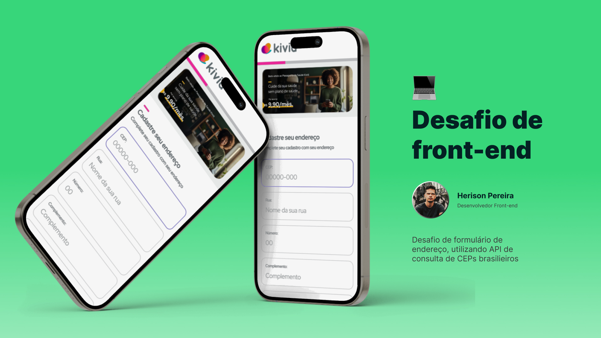

# Desafio de Frontend - Kivid

<div align="center">
  
</div>

## Veja online

[💻 Deploy](https://herison-kivid.vercel.app) -
[📕 Storybook](https://herison-kivid-sb.vercel.app) -
[🎨 Figma](https://www.figma.com/file/IArvuvfP6XWjx3Xs2xYdio/%5BKivid%5D-Desafio---Formul%C3%A1rio-de-endere%C3%A7o?type=design&node-id=0%3A1&mode=design&t=NZJYgNqX9l9cGbKP-1)

## Inicie o projeto localmente

Após fazer o clone do repositório, faça a instalação das dependências com o comando:

```bash
npm install
```

Em seguida inicie o Next no modo desenvolvimento:

```bash
npm run dev
```

E acesse por http://localhost:3000

### Storybook

Para iniciar o Storybook, execute:

```bash
npm run storybook
```

Acesse através http://localhost:6006

## Sobre o desafio

O objetivo principal do desafio proposto foi desenvolver uma aplicação utilizando um CEP para obter o endereço completo via API dos Correios (ViaCep ou BrasilAPI).

Além disso, precisava fazer uso de tecnologia como Next, Typescript, Tailwindcss, Styled Components e Storybook.

### Solução

#### Layout

Como o desafio não fazia sugestão de nenhum layout, resolvi criar um formulário e utilizar como base componentes parecidos com o que a Kivid já utiliza em seu site.

#### Componentização

Criei os principais componentes que mais se repetiam e/ou poderiam se repetir em escala, utilizando Styled Components. Com isso, os elementos ganham consistência e melhor manutenibilidade.

Já o Tailwindcss, usei suas classes modificadoras como um "layoutador". Isso quer dizer que, dei prioridade para estilizar estrutura e posicionamento dos componentes.

#### Consulta de API

Para lidar com as consultas dos CEPs, resolvi utilizar a BrasilAPI, que trás mais informações de erros em seus retornos e por ter um padrão de inglês para o nome de suas chaves de objeto retornado.

Na função de consulta, criei utilizando o recurso de server side do Next, que faz toda parte de cacheamento dos dados, onde escolhi colocar um revalidate de 1 dia. Fazendo com que o endereço fique no cache do nosso servidor, deixando nossa aplicação mais rápida e leve.

#### Demais informações

Além dos detalhes mencionados acima:

- fiz uso de biblioteca para formatar CEP (@utils-fns/mask)
- Criei um hook chamado useFormAddress para lidar com toda as funcionalidades do formulário
- Fiz uso de useState e useEffects para trabalhar estados da aplicação no lado do cliente
